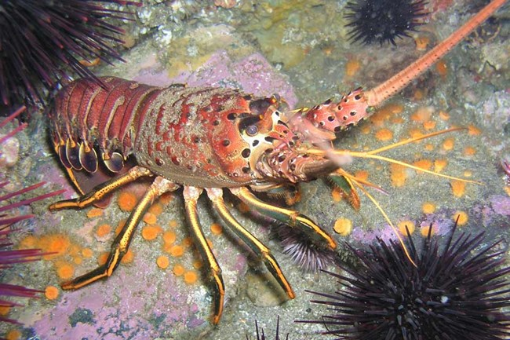
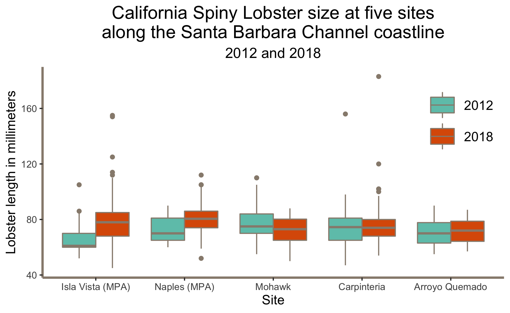

```{r setup, include = FALSE}
knitr::opts_chunk$set(echo = FALSE, warning = FALSE)
```

```{r, include = FALSE}
# Attach packages

library(tidyverse)
library(knitr)
library(here)
library(janitor)
library(dplyr)
library(lubridate)
library(tidyr)
library(effsize)
library(kableExtra)
library(plotly)
library(directlabels)
```

```{r, include = FALSE}
# Read in data, tidy, and save it as a CSV.

lobster_clean <- read_csv(here::here("raw_data", "lobster_abundance_sbc_lter.csv"), na = "-99999") %>% 
  clean_names() %>% 
  mutate(date = ymd(date)) %>% 
  mutate(day = day(date)) %>% 
  select(-date)
    
write_csv(lobster_clean, "lobster_clean.csv")
```
<br>
<br>

#### **INTRODUCTION**

This report looks at California Spiny Lobster (*Panulirus interruptus*, Figure 1) abundance and size along the Santa Barbara coast from 2012 - 2018. The spiny lobster is found in giant kelp forests in Southern California and is an important predator in these ecosystems. Spiny lobsters are also a prized target for both commercial and recreational fishermen and divers in the area. The data for this report comes from five long term kelp forest study sites along the mainland coast of the Santa Barbara Channel. Two of these sites are within Marine Protected Areas (MPAs) that were established on January 1, 2012; the other three sites are not within MPAs. It is prohibited to take spiny lobsters within the two marine protected areas - Naples Reef and Isla Vista Reef. By looking at time-series data over a seven year period, we will analyze if and how lobster abundance and size changed over time within MPAs as compared to reefs that are not protected.  

<br>

 

<br>
<br>

#### **DATA AND METHODS**

The data comes from Santa Barbara Long-Term Ecological Research (LTER), a research program based at the University of California, Santa Barbara Marine Science Institute. Data was collected beginning in 2012 by divers within five long term kelp forest study sites (Figure 2). Sampling on lobster size and abundance was taken annually in late summer prior to the start of fishing season at Naples, Isla Vista, Arroyo Quemado, Mohawk, and Carpinteria reefs. The variables studied in this report are lobster size, abundance, and protected status. Non-paired t-tests were performed, with an alpha of 0.025 used to indicate statistical significance; Cohen’s d was calculated to measure effect size. The software used for this analysis was RStudio Version 1.2.1335.

<br>


<br>
<br>

#### **RESULTS A:** Lobster abundance over time.

<br>

```{r}
# Going to create a summary table that lists total lobsters per year per site   

lobster_year <- lobster_clean %>% 
  mutate(total_lobsters = count + num_ao) %>% 
  group_by(year, site) %>% 
  summarize(total_lobsters = sum(total_lobsters))

# Rename sites within data set
lobster_year$site[lobster_year$site == "AQUE"] <- "Arroyo Quemado"
lobster_year$site[lobster_year$site == "CARP"] <- "Carpinteria"
lobster_year$site[lobster_year$site == "NAPL"] <- "Naples (MPA)"
lobster_year$site[lobster_year$site == "IVEE"] <- "Isla Vista (MPA)"
lobster_year$site[lobster_year$site == "MOHK"] <- "Mohawk"

#____________________________
# Graph it!

ggplot(data = lobster_year, aes(x = year, y = total_lobsters)) +
         geom_line(aes(color = site), show.legend = FALSE) +
  labs(x = "Year",
       y = "Lobster Count",
       title = "California Spiny Lobster abundance at five sites
       along the Santa Barbara Channel coastline",
       subtitle = "2012 - 2018") +
  theme_light() +
  theme(plot.title = element_text(size = rel(1.5), 
                                  hjust = 0.5, 
                                  lineheight = 0.9),
        plot.subtitle = element_text(size = rel(1.2), 
                                    hjust = 0.5)) +
  scale_x_continuous(lim = c(2012, 2019.5), expand = c(0, 0)) +
  scale_y_continuous(lim = c(0, 1000), expand = c(0, 0)) +
  # Direct labels to label the lines instead of a legend
  geom_dl(aes(label = site), method = list("last.points", cex = .65, hjust = -.17)) +
  # Change colors of the lines 
  scale_color_manual(values = c("lightcoral", "gold3", "steelblue1", "mediumorchid", "darkturquoise"))
```
**Figure 3.** California Spiny Lobster count from 2012 to 2018 at two MPA sites (Isla Vista and Naples) and three non-MPA sites (Mohawk, Carpinteria, and Arroyo Quemado).

In 2012, lobster abundance was similar across all five sites. (Figure 3). At the two MPA reefs, there was a general upward trend of lobster abundance from 2012-2018. Lobster abundance at Isla Vista Reef showed the greatest increase over time.

<br>
<br>

#### **RESULTS B:** Lobster size distributions in 2012 and 2018.

<br>

```{r, include = FALSE}
lobster_tidy_data <- read_csv(here::here("clean_data", "lobster_clean.csv"))

# This is not quite in tidy format. SOme rows store multiple observations. I need to separate those, so that every row contains a distinct observation. I'll also take this opportunity to narrow down to my variables of interest.

lobster_tidier_data <- lobster_tidy_data %>%
  filter(year == "2012"|year == "2018") %>% 
  select(year, site, size_mm, count) %>% 
  uncount(count)

# Okay. Now, I want to find the average lobster size for each site by year.

size_averages <- lobster_tidier_data %>% 
  group_by(site, year) %>% 
  summarize(avg_size = mean(size_mm))

# Now, to graph:

ggplot() +
  labs(x = "Site",
       y = "Lobster length in millimeters",
       title = 
       "California Spiny Lobster size at five sites
along the Santa Barbara Channel coastline",
       subtitle = "2012 and 2018"
       ) +
  theme(panel.grid.major  = element_line(color = "transparent"),
        panel.background = element_rect(fill = "white"),
        axis.line = element_line(size = 1,
                                  color = "#978B7D"),
        panel.grid.minor.y = element_blank(),
        axis.title = element_text(size = rel(1.1)),
        plot.title = element_text(size = rel(1.5), 
                                  hjust = 0.5, 
                                  lineheight = 0.9),
        plot.subtitle = element_text(size = rel(1.2), 
                                    hjust = 0.5),
        legend.position = c(.99, .95),
        legend.justification = c("right", "top"),
        legend.title = element_blank(),
        legend.text = element_text(size = rel(1.1)),
        legend.key = element_rect(fill = "white"),
        legend.key.size = unit(2, "line")
  ) +
  geom_boxplot(
    data = lobster_tidier_data,
    aes(
      x = site,
      y = size_mm,
      fill = factor(year)
      ),
    stat = "boxplot",
    position= "dodge",
    outlier.colour = "#978B7D",
    color = "#978B7D"
    ) +
  scale_fill_manual(
    values = c("#6EC5B8", "#DC5C05")
    ) +
  scale_x_discrete(
    limits = c('IVEE', 'NAPL', 'MOHK', 'CARP', 'AQUE'),
    labels = c("Isla Vista (MPA)", "Naples (MPA)", "Mohawk", "Carpinteria", "Arroyo Quemado"),
    )

# Save in the figures folder
ggsave(here::here("figures", "results_b.png"))
```



**Figure 4.** California Spiny Lobster size distribtions (in mm) in 2012 and 2018 at two MPA sites (Isla Vista and Naples) and three non-MPA sites (Mohawk, Carpinteria, and Arroyo Quemado).

At Naples and Isla Vista reefs, community size structure distributions shifted, with higher upper limits in 2018 (Figure 4). Distrubution of community size structure at Mohawk decreased over the time period.

<br>
<br>

#### **RESULTS C:** Mean lobster size at MPA and non-MPA sites in 2012 and 2018.

<br>

```{r, include = FALSE}

# Set up a data frame to analyze the difference in means.

lobster_stats_df <- lobster_tidy_data %>%
  mutate(mpa = if_else(lobster_tidy_data$site %in% c("IVEE", "NAPL"), "mpa", "non-mpa"))

lobster_stats_df <- lobster_stats_df %>% 
  uncount(count)

# Look at a QQ plot:

# ggplot(lobster_stats_df, aes(sample = size_mm)) +
#  geom_qq()

# The data is distributed roughly normally, with some outliers on the leading tail.

# ------------------------
# Lobster size, 2012 and 2018
# Summary statistics and analysis
# -------------------

# MPA:
mpa_2012 <- lobster_stats_df %>% 
  filter(year == "2012") %>% 
  filter(mpa == "mpa")

mpa_2018 <- lobster_stats_df %>% 
  filter(year == "2018") %>% 
  filter(mpa == "mpa")

# non-MPA:
non_2012 <- lobster_stats_df %>% 
  filter(year == "2012") %>% 
  filter(mpa == "non-mpa")

non_2018 <- lobster_stats_df %>% 
  filter(year == "2018") %>% 
  filter(mpa == "non-mpa")

# -------------------

# Sample size (MPAs):
n_mpa_12 <- sum(!is.na(mpa_2012$mpa))
n_mpa_18 <- sum(!is.na(mpa_2018$mpa))

# Sample size (non-MPAs):
n_non_12 <- sum(!is.na(non_2012$mpa))
n_non_18 <- sum(!is.na(non_2018$mpa))

# -------------------

# Means (2012, MPA and Non):
mean_mpa_12 <- mean(mpa_2012$size_mm, na.rm = TRUE)
mean_non_12 <- mean(non_2012$size_mm, na.rm = TRUE)

# Means (2018, MPA and Non):
mean_mpa_18 <- mean(mpa_2018$size_mm, na.rm = TRUE)
mean_non_18 <- mean(non_2018$size_mm, na.rm = TRUE)

# -------------------

# Medians (2012, MPA and Non):
median_mpa_12 <- median(mpa_2012$size_mm, na.rm = TRUE)
median_non_12 <- median(non_2012$size_mm, na.rm = TRUE)

# Medians (2018, MPA and Non):
median_mpa_18 <- median(mpa_2018$size_mm, na.rm = TRUE)
median_non_18 <- median(non_2018$size_mm, na.rm = TRUE)

# -------------------

# Standard deviations (2012, MPA and Non):
sd_mpa_12 <- sd(mpa_2012$size_mm, na.rm = TRUE)
sd_non_12 <- sd(non_2012$size_mm, na.rm = TRUE)

# Standard deviations (2018, MPA and Non):
sd_mpa_18 <- sd(mpa_2018$size_mm, na.rm = TRUE)
sd_non_18 <- sd(non_2018$size_mm, na.rm = TRUE)

# ------------------
# Analysis
# ------------------

#### Are observations paired or unpaired? 

# 1.

# Null hypothesis: The mean lobster size is the same in MPA and non-MPA sites for 2012 observations.

# Alternative hypothesis: The mean lobster size is NOT the same in MPA and non-MPA sites for 2012 observations.

# 2.

# Null hypothesis: The mean lobster size is the same in MPA and non-MPA sites for 2018 observations.

# Alternative hypothesis: The mean lobster size is NOT the same in MPA and non-MPA sites for 2018 observations.

# When comparing MPA and non-MPA sites, our observations were grouped. We are not comparing transects at each reef, because lobsters move. The transects are a relative measurement, and don't tell us anything about lobster distribution across reefs.

# We're not comparing individual lobsters over time. So, our t-test will be unpaired.

size_test_2012 <- t.test(mpa_2012$size_mm, non_2012$size_mm, paired = FALSE)

size_test_2018 <- t.test(mpa_2018$size_mm, non_2018$size_mm, paired = FALSE)

# -----------------
# Effect size (1 and 2)
# -----------------

# 2012 samples
d_2012 <- effsize::cohen.d(non_2012$size_mm, mpa_2012$size_mm, na.rm = TRUE)
d_2012

# We have a moderate effect size for 2012 (d = 0.6).

# 2018 samples
d_2018 <- effsize::cohen.d(non_2018$size_mm, mpa_2018$size_mm, na.rm = TRUE)
d_2018

# We have a small effect size for 2018 (d = 0.3).

# THIS MEANS:
# The size differences between the lobsters was statistically significant in 2012 and 2018 (p < 0.05). But, in 2012, the difference between mean lobster size at MPA and non-MPA reefs was larger (-7.5 mm) than in 2018 (4.0 mm). 

# We also looked at the confidence intervals and absolute differences in means.

difference_2012 <- mean_mpa_12 - mean_non_12

difference_2018 <- mean_mpa_18 - mean_non_18

# ---------------
# Mean size at MPA 2012 - 2018 (3)
# ---------------

size_test_mpa <- t.test(mpa_2012$size_mm, mpa_2018$size_mm, paired = FALSE)
size_test_mpa

# ---------------
# Mean size at non-MPA 2012 - 2018 (4)
# ---------------

size_test_non <- t.test(non_2012$size_mm, non_2018$size_mm, paired = FALSE)
size_test_non

# p = 0.18 ( p > 0.05)

# ---------------
# Effect size (3 and 4)
# ---------------
# MPA observations
d_mpa <- effsize::cohen.d(mpa_2012$size_mm, mpa_2018$size_mm, na.rm = TRUE)
d_mpa

# We have a large effect size for MPA lobster size in 2012 vs. 2018 (d > 0.8).

# non-MPA observations
d_non <- effsize::cohen.d(non_2012$size_mm, non_2018$size_mm, na.rm = TRUE)
d_non

# We have a negligible effect size for non-MPA lobster size between 2012 and 2018 (d < 0.2).

# Difference between means of MPAs 2012 v. 2018 and non-MPAs 2012 v. 2018
difference_mpas <- mean_mpa_12 - mean_mpa_18

difference_non <- mean_non_12 - mean_non_18
```

```{r, include = FALSE}
# Now, we want to present this information in a table. We'll start by creating a new data frame with our summary statistics

lobster_summary <- lobster_stats_df %>%
  filter(year %in% c(2012,2018)) %>% 
  select(year, mpa, size_mm) %>% 
  group_by(year, mpa) %>% 
  summarise(sample_size = n(),
            mean = mean(size_mm, na.rm = TRUE),
            sd = sd(size_mm, na.rm = TRUE)) %>% 
  mutate_if(is.numeric, round, 1)

# These calculations match my stored values, which indicates that I haven't made any mistakes here. Now, to create my Kable table.

lobster_table <- lobster_summary %>% 
  kable(col.names = c("Sample year",
                      "Protected status",
                      "Sample size",
                      "Mean lobster length (mm)",
                      "Standard deviation")) %>% 
  kable_styling(position = "center",
                bootstrap_options = "striped", "hover",
                full_width = F) 
```


**Figure 5.** Descriptive Statistics.
```{r}
lobster_table
```
The 2012 and 2018 sample sizes differed, with the 2012 sample being smaller than 2018 for both MPA and non-MPA sites (Figure 5). Because of this, we placed greater analytical value on the difference between the means and effect size to understand the impact of marine protected status on lobster size than the *p* value.

<br>

##### Mean lobster size between MPA and non-MPA sites in 2012.

Mean lobster size at MPAs was `r round(-difference_2012, 1)`mm smaller than mean lobster size at non-MPA sites in 2012. Mean lobster size (mm) at MPA reefs (`r round(mean_mpa_12, 1)` mm, SD = `r round(sd_mpa_12, 2)`, n = `r n_mpa_12`) differed significantly from mean lobster size at non-MPA reefs (`r round(mean_non_12, 1)` mm, SD = `r round(sd_non_12, 2)`, n = `r n_non_12`) by a non-paired two-sample t-test (t(`r round(size_test_2012$parameter, 2)`) = `r round(-size_test_2012$statistic, 2)`, *p* < 0.025). There is a moderate effect size (d = `r round(d_2012$estimate, 2)`) for lobster size in MPA vs. non-MPA reefs for 2012.

<br>

##### Mean lobster size between MPA and non-MPA sites in 2018.

Mean lobster size at MPAs was `r round(difference_2018, 1)`mm larger than mean lobster size at non-MPA sites in 2018. Mean lobster size (mm) at MPA reefs (`r round(mean_mpa_18, 1)` mm, SD = `r round(sd_mpa_18, 2)`, n = `r n_mpa_18`) differed significantly from mean lobster size at non-MPA reefs (`r round(mean_non_18, 1)` mm, SD = `r round(sd_non_18, 2)`, n = `r n_non_18`) by a non-paired two-sample t-test (t(`r round(size_test_2018$parameter, 2)`) = `r round(size_test_2018$statistic, 2)`, *p* < 0.025). There is a small effect size (d = `r round(-d_2018$estimate, 2)`) for lobster size in MPA vs. non-MPA reefs for 2018.

<br>

##### Mean lobster size in MPA sites between 2012 and 2018.

Mean lobster size at MPA reefs was `r round(-difference_mpas, 1)`mm larger in 2018 than in 2012. Mean lobster size (mm) at MPA reefs in 2012 (`r round(mean_mpa_12, 1)` mm, SD = `r round(sd_mpa_12, 2)`, n = `r n_mpa_12`) differed significantly from mean lobster size at MPA reefs in 2018 (`r round(mean_mpa_18, 1)` mm, SD = `r round(sd_mpa_18, 2)`, n = `r n_mpa_18`) by a non-paired two-sample t-test (t(`r round(size_test_mpa$parameter, 2)`) = `r round(-size_test_mpa$statistic, 2)`, *p* < 0.025). There is a large effect size (d = `r round(-d_mpa$estimate, 2)`) for lobster size within MPA reefs in 2012 vs. 2018.

<br>

##### Mean lobster size in non-MPA sites between 2012 and 2018.

Mean lobster size at non-MPA reefs was `r round(difference_non, 1)`mm smaller in 2018 than in 2012. Mean lobster size (mm) at non-MPA reefs in 2012 (`r round(mean_non_12, 1)` mm, SD = `r round(sd_non_12, 2)`, n = `r n_non_12`) did not differ significantly from mean lobster size at non-MPA reefs in 2018 (`r round(mean_non_18, 1)` mm, SD = `r round(sd_non_18, 2)`, n = `r n_non_18`) by a non-paired two-sample t-test (t(`r round(size_test_non$parameter, 2)`) = `r round(size_test_non$statistic, 2)`, *p* > 0.025). There is a negligible effect size (d = `r round(d_non$estimate, 2)`) for lobster size within non-MPA reefs in 2012 vs. 2018.

<br>
<br>

#### SUMMARY

- The two MPA reefs (Naples and Isla Vista) showed an increase in both lobster abundance (Figure 3) and lobster community size structure distribution (Figure 4) between 2012 and 2018.
- There was a statistically significant increase in mean lobster size (with a large effect size) within the MPA reefs in 2018 as compared to 2012. This demonstrates that closing these reefs to fishing had a positive effect on the Spiny lobster population size.
- Similarly, in 2018 mean lobster size at MPA reefs was statistically significantly larger (although with a small effect size) than mean lobster size at non-MPA reefs in 2018.
- There was no statistically significant difference found at non-MPA reefs when comparing lobster size between 2012 and 2018. This shows that keeping the reef open to fishing, or a "business-as-usual" scenario, did not effect lobster size. 

<br>
<br>

#### REFERENCES

Frimodig, Adam, and Travis Buck. *State of the California South Coast Supplemental Report: California Spiny Lobster.* California Department of Fish and Wildlife, 2017, *State of the California South Coast Supplemental Report: California Spiny Lobster.*

Reed D. 2019. SBC LTER: Reef: Abundance, size and fishing effort for California Spiny Lobster (*Panulirus interruptus*), ongoing since 2012. Environmental Data Initiative. https://doi.org/10.6073/pasta/a593a675d644fdefb736750b291579a0. Dataset accessed 10/30/2019.

*Santa Barbara Coastal LTER,* sbclter.msi.ucsb.edu/.
